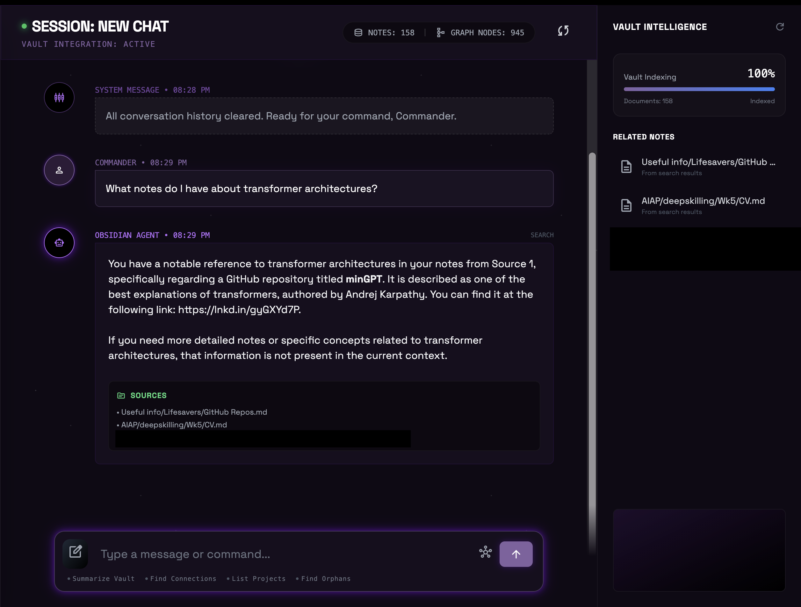
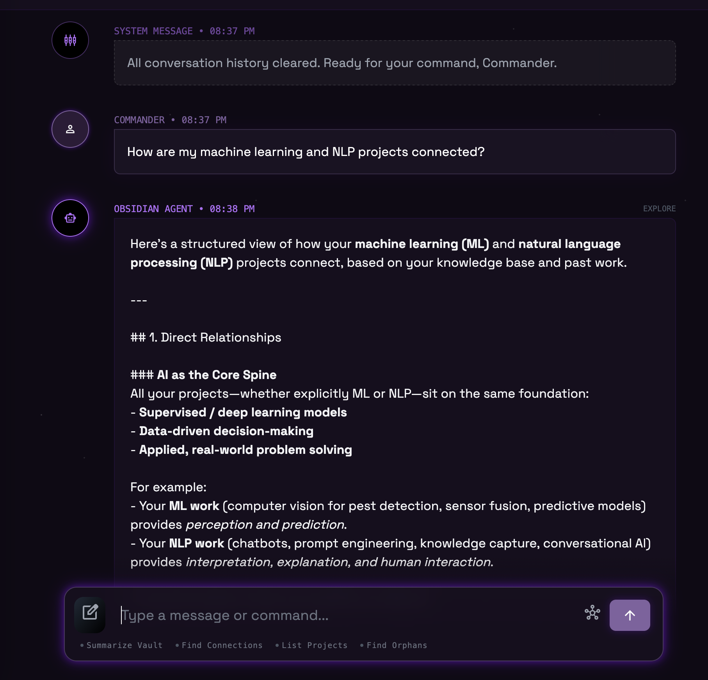
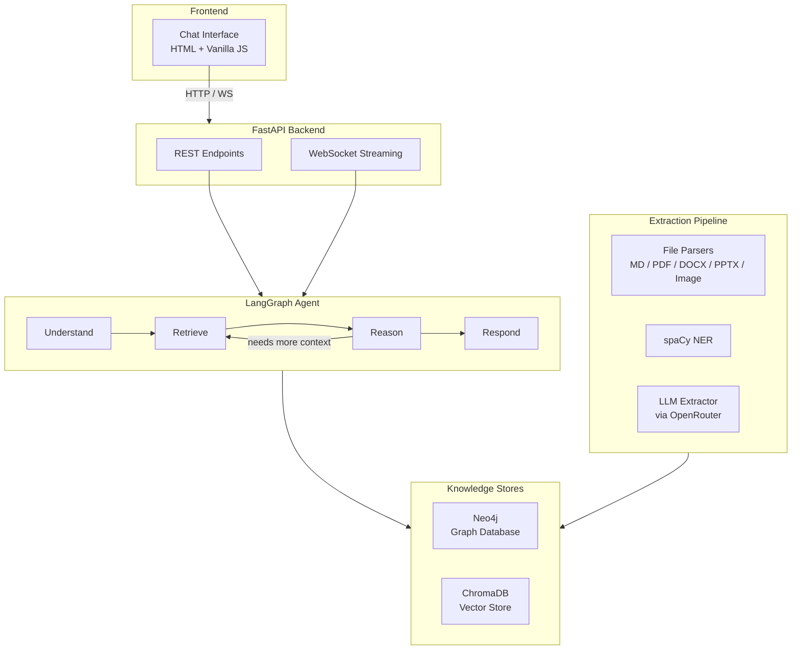
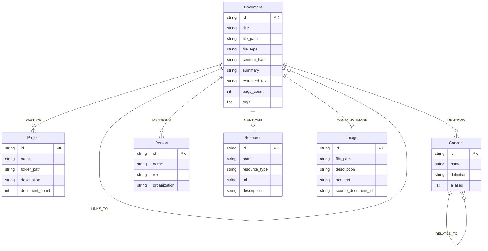
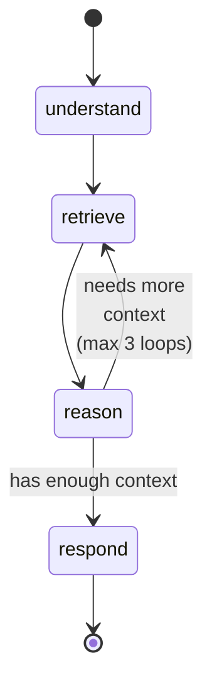
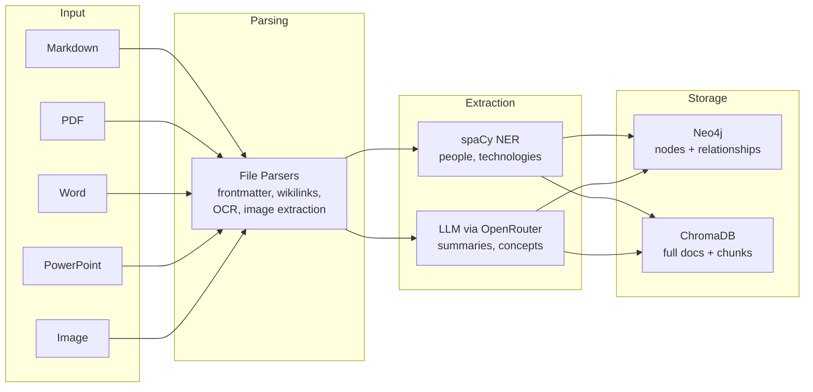

# Personal Knowledge Agent

AI-powered knowledge management system that transforms an Obsidian vault into a queryable knowledge graph with conversational retrieval.

[](https://python.org)
[](https://neo4j.com)
[](https://langchain-ai.github.io/langgraph/)
[](https://fastapi.tiangolo.com)
[](https://www.trychroma.com)

- **Graph-based knowledge retrieval** — 6 node types and 5 relationship types in Neo4j, queried via Cypher for multi-hop reasoning
- **Dual retrieval strategy** — Every query hits both ChromaDB (semantic similarity) and Neo4j (graph traversal), results are fused before reasoning
- **LangGraph state machine** — 4-node cyclic agent with conditional looping for iterative retrieval-augmented generation
- **Multi-format extraction pipeline** — Parses Markdown, PDF, DOCX, PPTX, and images (OCR + vision LLM) into structured entities
- **Real-time sync** — File watcher for incremental vault updates via `watchdog`

---

## Example Interactions

**Semantic search** (intent: `search`):
```
User: "What notes do I have about transformer architectures?"

→ understand: intent=search, entities=["transformer architectures"]
→ retrieve:   ChromaDB finds 4 semantically similar chunks
             Neo4j matches Concept{name: "Transformers"}
→ reason:     Synthesizes context from both sources
→ respond:    "You have 3 documents covering transformers: ..."
             Sources: [attention-paper.md, ml-notes.md, project-nlp/README.md]
```



**Graph exploration** (intent: `explore`):
```
User: "How are my machine learning and NLP projects connected?"

→ understand: intent=explore, entities=["machine learning", "NLP"]
→ retrieve:   Neo4j shortestPath between Concept{ML} and Concept{NLP}
             ChromaDB finds documents mentioning both
→ reason:     Maps relationships: ML → shared concepts → NLP
→ respond:    "Your ML and NLP projects share 5 concepts: ..."
```



---

## Architecture Overview



The system has four major subsystems:

| Subsystem | Role |
|-----------|------|
| **LangGraph Agent** | Processes user queries through a 4-node state machine with cyclic retrieval |
| **Knowledge Stores** | Neo4j for structured graph queries, ChromaDB for semantic vector search |
| **Extraction Pipeline** | Converts vault files into graph nodes, relationships, and vector embeddings |
| **FastAPI API** | Exposes chat, search, knowledge CRUD, graph visualization, and sync endpoints |

---

## Graph Database Design

### Schema



### Cypher Examples

**Schema initialization** — uniqueness constraints and property indexes:

```cypher
-- Constraints ensure no duplicate entities
CREATE CONSTRAINT document_id IF NOT EXISTS
  FOR (d:Document) REQUIRE d.id IS UNIQUE;
CREATE CONSTRAINT concept_id IF NOT EXISTS
  FOR (c:Concept) REQUIRE c.id IS UNIQUE;

-- Indexes accelerate text lookups
CREATE INDEX document_title IF NOT EXISTS
  FOR (d:Document) ON (d.title);
CREATE INDEX concept_name IF NOT EXISTS
  FOR (c:Concept) ON (c.name);
```

**MERGE upsert pattern** — idempotent insert-or-update for all entity types:

```cypher
MERGE (d:Document {id: $id})
SET d.title = $title,
    d.file_path = $file_path,
    d.file_type = $file_type,
    d.content_hash = $content_hash,
    d.summary = $summary,
    d.extracted_text = $extracted_text,
    d.updated_at = datetime()
```

**Shortest path traversal** — finds connections between any two entities:

```cypher
MATCH path = shortestPath(
    (start {id: $start_id})-[*1..3]-(end {id: $end_id})
)
RETURN path
```

**Variable-length path matching** — retrieves neighbors at configurable depth:

```cypher
MATCH (n {id: $node_id})-[r*1..2]-(neighbor)
RETURN DISTINCT neighbor, type(r[0]) as relationship
```

**UNION ALL aggregation** — graph-wide statistics across all node types:

```cypher
CALL {
    MATCH (d:Document) RETURN 'Document' as label, count(d) as count
    UNION ALL
    MATCH (p:Project) RETURN 'Project' as label, count(p) as count
    UNION ALL
    MATCH (c:Concept) RETURN 'Concept' as label, count(c) as count
    UNION ALL
    MATCH (p:Person) RETURN 'Person' as label, count(p) as count
    UNION ALL
    MATCH (r:Resource) RETURN 'Resource' as label, count(r) as count
    UNION ALL
    MATCH (i:Image) RETURN 'Image' as label, count(i) as count
}
RETURN label, count
```

**Edge deduplication for visualization** — prevents rendering duplicate edges:

```cypher
MATCH (n)
WITH n LIMIT $limit
OPTIONAL MATCH (n)-[r]-(m)
WHERE id(m) < id(n)
RETURN
    collect(DISTINCT {id: n.id, label: labels(n)[0], name: coalesce(n.name, n.title, 'Unknown')}) as nodes,
    collect(DISTINCT {source: startNode(r).id, target: endNode(r).id, type: type(r)}) as edges
```

---

## LangGraph Agent Architecture

### State Machine



### Node Responsibilities

| Node | What it does |
|------|-------------|
| **understand** | LLM-based intent classification (search / explore / add / summarize / reason / general) + entity extraction. Falls back to keyword matching if LLM call fails. |
| **retrieve** | Dual retrieval: queries ChromaDB for semantic matches AND Neo4j for graph-based results. Merges both into the context list. |
| **reason** | LLM call with intent-specific prompt templates. Includes conversation history for multi-turn context. Can set `should_continue = True` to trigger another retrieval loop. |
| **respond** | Formats the final response and appends source citations from retrieved context metadata. |

### Agent State

The full state passed between nodes (`backend/agent/state.py`):

```python
class AgentState(BaseModel):
    messages: Annotated[list, add_messages] = Field(default_factory=list)
    conversation_history: list[ConversationMessage] = Field(default_factory=list)
    query: str = ""
    intent: Literal["search", "explore", "add", "summarize", "reason", "general"] = "general"
    context: list[RetrievedContext] = Field(default_factory=list)
    graph_paths: list[GraphPath] = Field(default_factory=list)
    entities: list[str] = Field(default_factory=list)
    response: str = ""
    should_continue: bool = False
    reasoning_steps: int = 0
    max_reasoning_steps: int = 3
```

### Conditional Edge Logic

The loop decision (`backend/agent/graph.py`):

```python
def should_continue_reasoning(state: AgentState) -> Literal["retrieve", "respond"]:
    """Determine if we should continue reasoning or respond."""
    if state.should_continue and state.reasoning_steps < state.max_reasoning_steps:
        return "retrieve"
    return "respond"

# Wired into the graph as:
workflow.add_conditional_edges(
    "reason",
    should_continue_reasoning,
    {"retrieve": "retrieve", "respond": "respond"},
)
```

---

## Extraction Pipeline



| Format | Parser | Special Handling |
|--------|--------|-----------------|
| `.md` | `MarkdownParser` | Frontmatter extraction, wikilink resolution, tag parsing |
| `.pdf` | `PDFParser` (PyMuPDF) | Page-level text extraction, embedded image extraction |
| `.docx` | `DocxParser` (python-docx) | Paragraph and table text |
| `.pptx` | `PptxParser` (python-pptx) | Slide-level text extraction |
| `.png` `.jpg` `.gif` | `ImageParser` | OCR via pytesseract + optional vision LLM description |

**Chunking strategy**: 1000-character chunks with 200-character overlap, with sentence-boundary snapping to avoid splitting mid-sentence.

**Incremental sync**: `watchdog`-based file watcher detects vault changes and processes only modified files.

---

## API Reference

Base URL: `http://localhost:8000/api`

### Chat

| Method | Endpoint | Description |
|--------|----------|-------------|
| `POST` | `/chat/message` | Send a message, receive agent response with intent + sources |
| `WS` | `/chat/ws` | WebSocket for streaming — sends `start`, `step` (per node), `complete` events |

### Search

| Method | Endpoint | Description |
|--------|----------|-------------|
| `GET` | `/search/?q=...` | Hybrid vector + graph search. Params: `type` (vector/graph/hybrid), `file_type`, `limit` |
| `GET` | `/search/suggest?q=...` | Autocomplete suggestions from graph entities |

### Knowledge

| Method | Endpoint | Description |
|--------|----------|-------------|
| `POST` | `/knowledge/concepts` | Add a concept to the graph |
| `GET` | `/knowledge/concepts` | List all concepts |
| `POST` | `/knowledge/people` | Add a person |
| `GET` | `/knowledge/people` | List all people |
| `POST` | `/knowledge/resources` | Add a resource |
| `GET` | `/knowledge/projects` | List all projects |
| `GET` | `/knowledge/projects/{id}/documents` | Documents in a project |
| `GET` | `/knowledge/stats` | Graph + vector store statistics |

### Graph

| Method | Endpoint | Description |
|--------|----------|-------------|
| `GET` | `/graph/visualization` | Nodes + edges for force-graph rendering. Params: `limit`, `center_node` |
| `GET` | `/graph/node/{id}` | Detailed node properties |
| `GET` | `/graph/paths?from_id=...&to_id=...` | `shortestPath` between two nodes |
| `GET` | `/graph/neighbors/{id}` | Neighboring nodes at configurable `depth` |
| `GET` | `/graph/stats` | Node counts by label |

### Sync

| Method | Endpoint | Description |
|--------|----------|-------------|
| `POST` | `/sync/full` | Trigger full vault extraction (background task) |
| `POST` | `/sync/file?file_path=...` | Sync a single file |
| `GET` | `/sync/status` | Current sync progress |
| `GET` | `/sync/vault/stats` | Vault file counts by type |
| `POST` | `/sync/watcher/start` | Start file watcher for incremental sync |
| `POST` | `/sync/watcher/stop` | Stop file watcher |
| `GET` | `/sync/watcher/status` | Watcher running state |

---

## Quick Start

```bash
# 1. Clone the repository
git clone https://github.com/yourusername/personal-agent.git
cd personal-agent

# 2. Start Neo4j
docker compose -f docker/docker-compose.yml up -d

# 3. Install dependencies
uv sync

# 4. Download spaCy model
uv run python -m spacy download en_core_web_sm

# 5. Configure environment
cp .env.example .env
# Edit .env — add your OPENROUTER_API_KEY and set VAULT_PATH

# 6. Run initial extraction
uv run python scripts/init_extraction.py

# 7. Start the backend
uv run python -m backend.main

# 8. Open the frontend (separate terminal)
uv run python scripts/serve_frontend.py
# Visit http://localhost:5173
```

For detailed setup, configuration, and troubleshooting, see **[docs/QUICKSTART.md](docs/QUICKSTART.md)**.

---

## Project Structure

```
personal-agent/
├── backend/
│   ├── agent/          # LangGraph state machine, nodes, and tools
│   ├── api/routes/     # FastAPI endpoints (chat, search, knowledge, graph, sync)
│   ├── extraction/     # File parsers, NLP/LLM extractors, file watcher
│   ├── knowledge/      # Neo4j and ChromaDB store interfaces, entity models
│   ├── config.py       # pydantic-settings configuration
│   └── main.py         # App entrypoint + lifespan wiring
├── frontend/           # Static HTML + vanilla JS chat interface
├── docker/             # Neo4j docker-compose setup
└── scripts/            # Vault extraction, frontend server, agent testing
```

---

## Tech Stack

| Component | Technology | Purpose |
|-----------|-----------|---------|
| Agent Framework | LangGraph + LangChain | Stateful multi-step agent with cyclic graph |
| Graph Database | Neo4j 5.17 (Community) | Entity storage, Cypher traversals, path finding |
| Vector Store | ChromaDB | Cosine similarity search over document embeddings |
| Embeddings | sentence-transformers (`all-MiniLM-L6-v2`) | Document and chunk embedding |
| LLM Access | OpenRouter (httpx) | Intent classification, summarization, concept extraction |
| NLP | spaCy (`en_core_web_sm`) | Named entity recognition, technology extraction |
| API Framework | FastAPI + Uvicorn | REST + WebSocket API with async support |
| Document Parsing | PyMuPDF, python-docx, python-pptx, pytesseract | Multi-format text extraction |
| File Watching | watchdog | Incremental vault sync on file changes |
| Config | pydantic-settings | Typed configuration from `.env` |
| Package Manager | uv | Fast Python dependency management |

